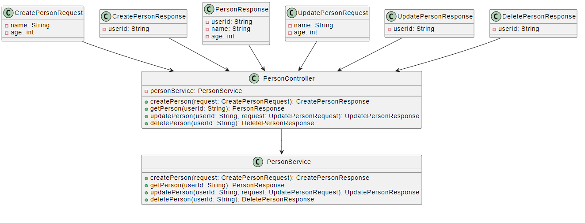

# REST API with Basic CRUD Operations

This is a simple REST API built with Node.js and SQLite3, capable of performing CRUD (Create, Read, Update, Delete) operations on a "User" resource.

## Table of Contents

- [REST API with Basic CRUD Operations](#rest-api-with-basic-crud-operations)
  - [Table of Contents](#table-of-contents)
  - [Installation](#installation)
  - [Usage](#usage)
  - [API Endpoints](#api-endpoints)
  - [UML Diagram](#uml-diagram)
  - [Documentation](#documentation)
  - [Hosting](#hosting)

## Installation

1. Clone the repository:
   ```
   git clone <repository_url>
   ```

2. Navigate to the project directory:
   ```
   cd <project_directory>
   ```

3. Install the required dependencies:
   ```
   npm install
   ```

## Usage

To run the API locally, follow these steps:

1. Start the server:
   ```
   npm start
   ```

2. The API will be available at `http://localhost:3000`.

## API Endpoints

- **Create a new person:**

  - Endpoint: `POST /api`
  - Request body:
    ```
    {
      "name": "John Doe"
    }
    ```
  - Response (example):
    ```
    {
      "id": 1,
      "name": "John Doe"
    }
    ```

- **Fetch details of a person by ID:**

  - Endpoint: `GET /api/:id`
  - Response (example):
    ```
    {
      "id": 1,
      "name": "John Doe"
    }
    ```

- **Update details of an existing person by ID:**

  - Endpoint: `PUT /api/:id`
  - Request body:
    ```
    {
      "name": "Jane Doe"
    }
    ```
  - Response (example):
    ```
    {
      "message": "User updated successfully"
    }
    ```

- **Remove a user by ID:**

  - Endpoint: `DELETE /api/:id`
  - Response (example):
    ```
    {
      "message": "User removed successfully"
    }
    ```

## UML Diagram



## Documentation

For more detailed information on how to use the API, request and response formats, and examples, please refer to the [DOCUMENTATION.md](DOCUMENTATION.md) file in the repository.

## Hosting

You can deploy this API to a hosting service like Heroku. Follow their documentation to set up the deployment and make your API accessible online.

